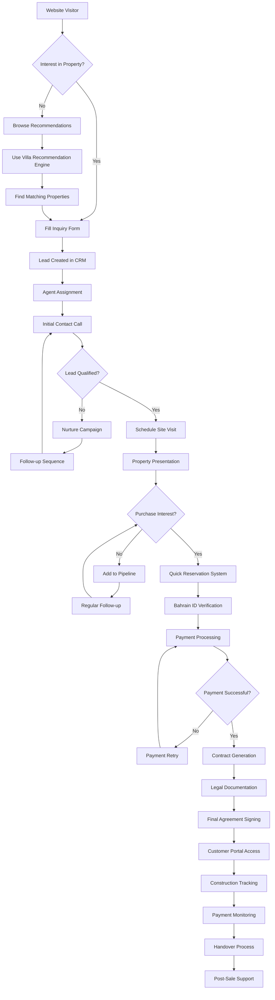
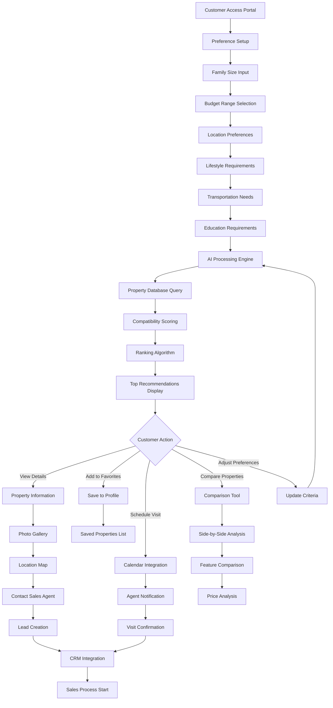
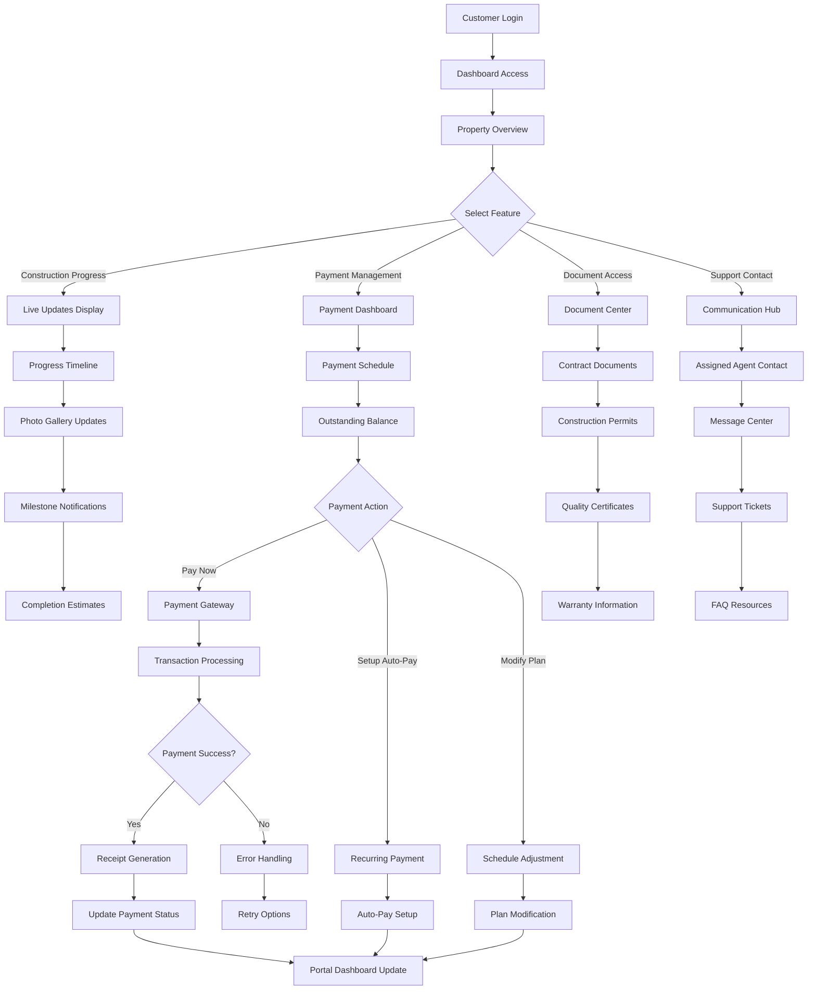
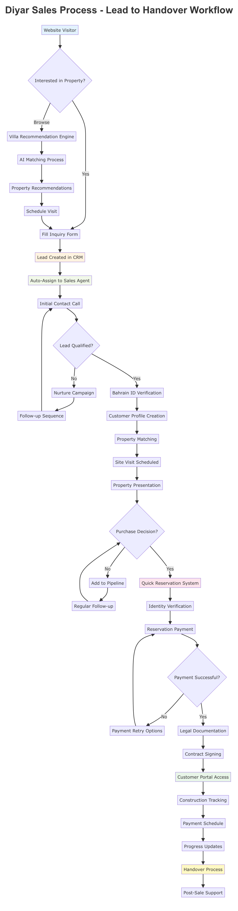
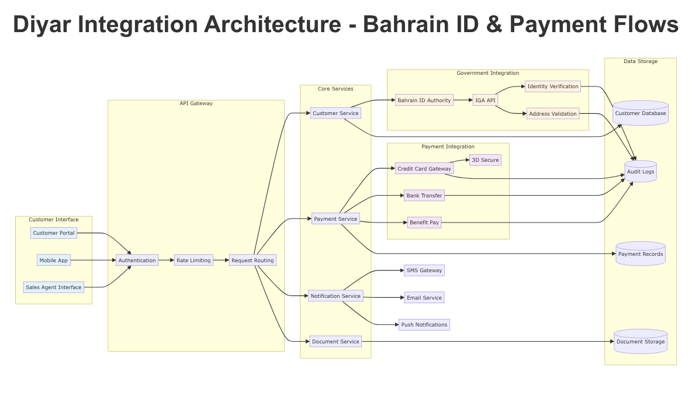
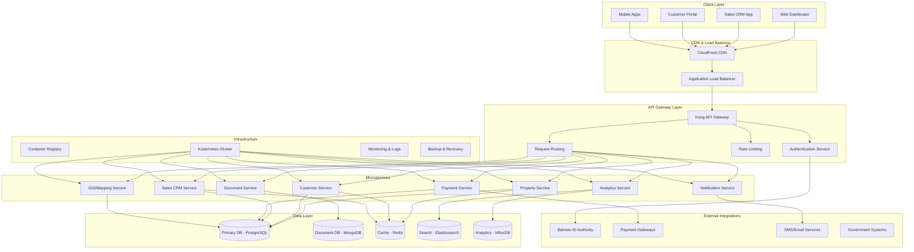
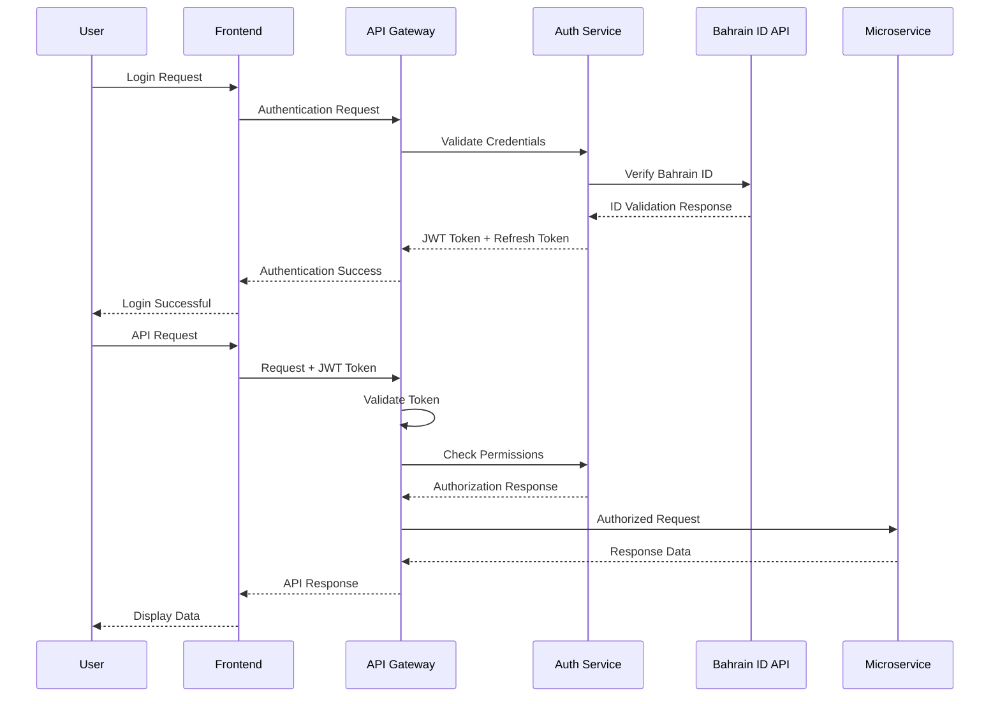
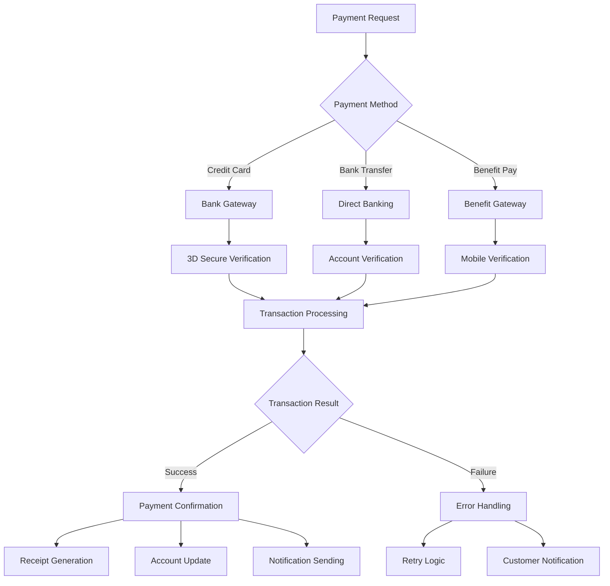

# Diyar.bh Property Management System - Comprehensive Wireframes & System Architecture

## Table of Contents
1. [Executive Summary](#executive-summary)
2. [System Overview & Architecture](#system-overview--architecture)
3. [Wireframe Designs](#wireframe-designs)
4. [User Flow Diagrams](#user-flow-diagrams)
5. [Technical Architecture](#technical-architecture)
6. [Integration Requirements](#integration-requirements)
7. [Security & Compliance](#security--compliance)
8. [Implementation Roadmap](#implementation-roadmap)

---

## Executive Summary

This document presents comprehensive wireframes and system architecture for Diyar.bh's property management system. The solution is designed to streamline property management operations across Diyar's 7-island development spanning 12 square kilometers, supporting residential villas, commercial plots, and integrated community services.

### Key System Components
- **Property Management Dashboard** with interactive mapping
- **Sales Team CRM** with lead-to-billing workflow
- **Villa Recommendation Engine** with AI-powered matching
- **Quick Reservation System** with Bahrain ID integration
- **Finance and Sales Dashboards** with real-time analytics
- **Customer Portal** with development tracking and payments
- **Interactive Location Map** with unit-level status tracking

### Business Context
Diyar Al Muharraq is Bahrain's leading real estate development company, managing integrated communities across multiple islands. The system must support diverse property types including residential villas (1-5+ bedrooms), commercial plots, and warehousing facilities across projects like Al Naseem, Al Bareh, and North Islands developments.

---

## System Overview & Architecture

### High-Level System Architecture

```
┌─────────────────────────────────────────────────────────────────┐
│                    Diyar.bh Property Management System          │
├─────────────────────────────────────────────────────────────────┤
│  Frontend Layer                                                 │
│  ┌─────────────┐ ┌─────────────┐ ┌─────────────┐ ┌─────────────┐│
│  │ Admin       │ │ Sales Team  │ │ Customer    │ │ Mobile      ││
│  │ Dashboard   │ │ CRM         │ │ Portal      │ │ Apps        ││
│  └─────────────┘ └─────────────┘ └─────────────┘ └─────────────┘│
├─────────────────────────────────────────────────────────────────┤
│  API Gateway & Authentication Layer                             │
│  ┌─────────────┐ ┌─────────────┐ ┌─────────────┐ ┌─────────────┐│
│  │ Auth        │ │ Rate        │ │ API         │ │ Bahrain ID  ││
│  │ Service     │ │ Limiting    │ │ Gateway     │ │ Integration ││
│  └─────────────┘ └─────────────┘ └─────────────┘ └─────────────┘│
├─────────────────────────────────────────────────────────────────┤
│  Core Services Layer                                            │
│  ┌─────────────┐ ┌─────────────┐ ┌─────────────┐ ┌─────────────┐│
│  │ Property    │ │ CRM &       │ │ Reservation │ │ Recommendation│
│  │ Management  │ │ Sales       │ │ System      │ │ Engine      ││
│  └─────────────┘ └─────────────┘ └─────────────┘ └─────────────┘│
│  ┌─────────────┐ ┌─────────────┐ ┌─────────────┐ ┌─────────────┐│
│  │ Finance &   │ │ Document    │ │ Notification│ │ Analytics   ││
│  │ Billing     │ │ Management  │ │ Service     │ │ Service     ││
│  └─────────────┘ └─────────────┘ └─────────────┘ └─────────────┘│
├─────────────────────────────────────────────────────────────────┤
│  Data Layer                                                     │
│  ┌─────────────┐ ┌─────────────┐ ┌─────────────┐ ┌─────────────┐│
│  │ Property    │ │ Customer    │ │ Financial   │ │ GIS/        ││
│  │ Database    │ │ Database    │ │ Database    │ │ Mapping     ││
│  └─────────────┘ └─────────────┘ └─────────────┘ └─────────────┘│
├─────────────────────────────────────────────────────────────────┤
│  External Integrations                                          │
│  ┌─────────────┐ ┌─────────────┐ ┌─────────────┐ ┌─────────────┐│
│  │ Bahrain ID  │ │ Payment     │ │ SMS/Email   │ │ Government  ││
│  │ Authority   │ │ Gateways    │ │ Services    │ │ Systems     ││
│  └─────────────┘ └─────────────┘ └─────────────┘ └─────────────┘│
└─────────────────────────────────────────────────────────────────┘
```

### Core Data Models

#### Property Data Model
```
Property {
  id: UUID
  project_name: String (Al Naseem, Al Bareh, etc.)
  property_type: Enum (Villa, Plot, Commercial)
  bedrooms: Integer (1-5+)
  size: Float (square meters)
  price: Decimal
  status: Enum (Available, Reserved, Sold, Under_Construction)
  location: GeoJSON
  amenities: Array<String>
  floor_plan: File
  images: Array<File>
  virtual_tour: String (URL)
  completion_date: Date
  handover_date: Date
}
```

#### Customer Data Model
```
Customer {
  id: UUID
  bahrain_id: String (encrypted)
  first_name: String
  last_name: String
  email: String
  phone: String
  nationality: String
  customer_type: Enum (Individual, Corporate)
  preferred_language: Enum (English, Arabic)
  preferences: CustomerPreferences
  lead_source: String
  assigned_agent: UUID
}
```

---

## Wireframe Designs

### 1. Property Management Dashboard with Interactive Mapping

```
┌─────────────────────────────────────────────────────────────────────────────────────┐
│ 🏠 Diyar Property Management    │ 👤 Admin User    🔔 (3)    ⚙️ Settings    🚪 Logout │
├─────────────────────────────────────────────────────────────────────────────────────┤
│ 📊 Dashboard  📋 Properties  👥 Customers  💰 Sales  📈 Reports  🗺️ Map View      │
├─────────────────────────────────────────────────────────────────────────────────────┤
│                                                                                     │
│ ┌─── Quick Stats ───────────────────────────────────────────────────────────────┐   │
│ │ 📈 Total Properties: 2,847  │ 💰 Total Revenue: 450M BHD  │ 🎯 Sales Target: 78% │   │
│ │ 🏗️ Under Construction: 324  │ 🏠 Available: 1,156        │ ✅ Sold: 1,367      │   │
│ └───────────────────────────────────────────────────────────────────────────────┘   │
│                                                                                     │
│ ┌─── Interactive Map View ──────────────┐ ┌─── Property Filters ──────────────────┐ │
│ │                                       │ │ Project: [All Projects ▼]             │ │
│ │  🗺️ [Interactive Map Component]       │ │ Type: [All Types ▼]                   │ │
│ │                                       │ │ Status: [All Status ▼]                │ │
│ │  Legend:                              │ │ Bedrooms: [Any ▼]                     │ │
│ │  🟢 Available  🟡 Reserved            │ │ Price Range: [Any ▼]                  │ │
│ │  🔴 Sold       🟠 Under Construction  │ │ Size Range: [Any ▼]                   │ │
│ │  🔵 Selected                          │ │                                       │ │
│ │                                       │ │ [Apply Filters] [Clear All]           │ │
│ │  Controls:                            │ │                                       │ │
│ │  [🔍 Zoom In] [🔍 Zoom Out]           │ └───────────────────────────────────────┘ │
│ │  [🎯 Center] [📐 Measure]             │                                         │
│ │  [📋 Export] [🖨️ Print]              │ ┌─── Recent Activities ─────────────────┐ │
│ │                                       │ │ • Villa V-1234 marked as Sold        │ │
│ └───────────────────────────────────────┘ │ • New reservation for Plot P-5678    │ │
│                                           │ • Payment received for Villa V-9012  │ │
│ ┌─── Property Details Panel ─────────────┐ │ • Construction update: Al Naseem     │ │
│ │ 🏠 Selected: Villa V-1234              │ │ • Customer inquiry for Commercial    │ │
│ │ 📍 Location: Al Naseem Phase 3         │ │                                     │ │
│ │ 🛏️ Bedrooms: 4  🚿 Bathrooms: 3        │ │ [View All Activities]               │ │
│ │ 📏 Size: 350 sq.m  💰 Price: 185K BHD  │ └─────────────────────────────────────┘ │
│ │ 📅 Status: Available                   │                                         │
│ │                                        │ ┌─── Quick Actions ──────────────────┐ │
│ │ [📝 Edit] [👁️ View] [📋 Details]       │ │ [➕ Add Property]                    │ │
│ │ [🔄 Change Status] [📞 Call Customer]  │ │ [📊 Generate Report]                │ │
│ └────────────────────────────────────────┘ │ [📧 Send Marketing Email]           │ │
│                                           │ [🗓️ Schedule Site Visit]             │ │
│                                           │ [💰 Record Payment]                  │ │
│                                           └─────────────────────────────────────┘ │
└─────────────────────────────────────────────────────────────────────────────────────┘
```

#### Key Features:
- **Real-time Interactive Map**: GIS-powered mapping showing all 7 islands with zoom, pan, and measurement tools
- **Color-coded Property Status**: Visual indicators for availability, reservations, sales, and construction status
- **Advanced Filtering**: Multi-criteria filtering by project, type, status, bedrooms, price, and size
- **Property Details Panel**: Contextual information panel that updates based on map selection
- **Quick Stats Dashboard**: Real-time KPIs including inventory levels, revenue, and sales targets
- **Activity Feed**: Recent transactions, status changes, and customer interactions
- **Quick Actions**: One-click access to common property management tasks

### 2. Sales Team CRM Interface with Lead-to-Billing Workflow

```
┌─────────────────────────────────────────────────────────────────────────────────────┐
│ 💼 Diyar Sales CRM             │ 👤 Sales Agent    🎯 Target: 78%    📞 (5) Calls    │
├─────────────────────────────────────────────────────────────────────────────────────┤
│ 🏠 Leads  📞 Calls  🤝 Meetings  💰 Opportunities  📄 Contracts  💳 Billing  📊 Reports │
├─────────────────────────────────────────────────────────────────────────────────────┤
│                                                                                     │
│ ┌─── Sales Pipeline ────────────────────────────────────────────────────────────────┐ │
│ │ Lead (24)      │ Qualified (18)  │ Negotiation (12) │ Contract (8)  │ Closed (5)  │ │
│ │ ┌───────────┐  │ ┌─────────────┐ │ ┌──────────────┐ │ ┌───────────┐ │ ┌─────────┐ │ │
│ │ │Ahmed Al-  │  │ │Sarah        │ │ │Mohammed     │ │ │Fatima     │ │ │Hassan   │ │ │
│ │ │Mahmoud    │  │ │Johnson      │ │ │Abdullah     │ │ │Al-Zahra   │ │ │Smith    │ │ │
│ │ │Villa 4BR  │  │ │Plot 500sqm  │ │ │Commercial   │ │ │Villa 5BR  │ │ │Villa 3BR│ │ │
│ │ │185K BHD   │  │ │125K BHD     │ │ │245K BHD     │ │ │285K BHD   │ │ │165K BHD │ │ │
│ │ │[Contact]  │  │ │[Schedule]   │ │ │[Send Offer] │ │ │[Generate] │ │ │[Invoice]│ │ │
│ │ └───────────┘  │ └─────────────┘ │ └──────────────┘ │ └───────────┘ │ └─────────┘ │ │
│ │ +12 more...    │ +8 more...      │ +4 more...       │ +3 more...    │ +2 more...  │ │
│ └───────────────────────────────────────────────────────────────────────────────────┘ │
│                                                                                     │
│ ┌─── Lead Details ──────────────────────────┐ ┌─── Workflow Actions ───────────────┐ │
│ │ 👤 Customer: Ahmed Al-Mahmoud             │ │ ✅ Lead Qualification               │ │
│ │ 📧 Email: ahmed.mahmoud@email.com         │ │ ┌─────────────────────────────────┐ │ │
│ │ 📞 Phone: +973-3456-7890                  │ │ │ □ Verify Bahrain ID             │ │ │
│ │ 🆔 Bahrain ID: ************1234           │ │ │ □ Check Financial Capacity      │ │ │
│ │ 🏠 Interest: 4BR Villa, Al Naseem        │ │ │ □ Confirm Property Requirements │ │ │
│ │ 💰 Budget: 180-200K BHD                   │ │ │ □ Schedule Site Visit           │ │ │
│ │ 📅 Created: 2025-09-28                    │ │ │ [Mark as Qualified]             │ │ │
│ │ 📍 Source: Website Inquiry                │ │ └─────────────────────────────────┘ │ │
│ │                                           │ │                                   │ │
│ │ 📝 Notes:                                 │ │ 📊 Opportunity Management          │ │
│ │ "Interested in Al Naseem project.         │ │ ┌─────────────────────────────────┐ │ │
│ │ Prefers 4BR with garden. Budget           │ │ │ Property: Villa V-4567          │ │ │
│ │ confirmed. Ready to visit site."          │ │ │ Price: 185,000 BHD              │ │ │
│ │                                           │ │ │ Discount: 5,000 BHD             │ │ │
│ │ [📝 Add Note] [📞 Call] [📧 Email]        │ │ │ Final Price: 180,000 BHD        │ │ │
│ │ [🗓️ Schedule] [📋 View History]           │ │ │ Commission: 3.6K BHD (2%)       │ │ │
│ └───────────────────────────────────────────┘ │ │ [Generate Proposal]             │ │ │
│                                               │ └─────────────────────────────────┘ │ │
│ ┌─── Customer Timeline ─────────────────────┐ │                                   │ │
│ │ 📅 2025-09-28: Initial inquiry received   │ │ 💳 Payment & Billing               │ │
│ │ 📞 2025-09-29: First contact call made    │ │ ┌─────────────────────────────────┐ │ │
│ │ 📧 2025-09-29: Property brochure sent     │ │ │ Down Payment: 18,000 BHD (10%)  │ │ │
│ │ 🗓️ 2025-09-30: Site visit scheduled       │ │ │ Installments: 162,000 BHD       │ │ │
│ │                                           │ │ │ Payment Plan: 24 months         │ │ │
│ │ [➕ Add Activity] [📊 View Full Timeline] │ │ │ Due Date: 2025-10-15            │ │ │
│ └───────────────────────────────────────────┘ │ │ [Generate Invoice]              │ │ │
│                                               │ │ [Setup Payment Plan]            │ │ │
│                                               │ └─────────────────────────────────┘ │ │
│                                               └───────────────────────────────────┘ │
└─────────────────────────────────────────────────────────────────────────────────────┘
```

#### Key Features:
- **Visual Sales Pipeline**: Kanban-style board showing leads through conversion stages
- **Lead-to-Billing Workflow**: Integrated process from initial contact to final payment
- **Bahrain ID Integration**: Secure customer verification and data validation
- **Customer Timeline**: Complete interaction history with automated activity tracking
- **Opportunity Management**: Deal structuring with pricing, discounts, and commission calculation
- **Payment Planning**: Flexible installment setup with automated billing cycles
- **Performance Tracking**: Individual and team sales metrics with target monitoring

### 3. Villa Recommendation Engine Interface

```
┌─────────────────────────────────────────────────────────────────────────────────────┐
│ 🤖 Diyar Villa Recommendation Engine      │ 👤 Customer Portal    🔍 Find My Villa    │
├─────────────────────────────────────────────────────────────────────────────────────┤
│ 🏠 Recommendations  🔍 Search  ❤️ Favorites  📊 Comparison  📞 Contact  💬 Chat      │
├─────────────────────────────────────────────────────────────────────────────────────┤
│                                                                                     │
│ ┌─── Smart Preference Setup ────────────────────────────────────────────────────────┐ │
│ │ 🎯 Tell us what you're looking for...                                             │ │
│ │                                                                                   │ │
│ │ 👥 Family Size: [2 Adults ▼] [2 Children ▼]                                      │ │
│ │ 💰 Budget Range: [100K] ═══●═════════ [300K] BHD                                  │ │
│ │ 🛏️ Bedrooms: [○ 1] [○ 2] [●● 3] [●● 4] [○ 5+]                                    │ │
│ │ 📍 Preferred Location: [All Projects ▼] [Al Naseem ✓] [Al Bareh ✓]               │ │
│ │                                                                                   │ │
│ │ 🏡 Lifestyle Preferences:                                                         │ │
│ │ [✓] Garden/Outdoor Space    [✓] Near Shopping Centers    [○] Waterfront View     │ │
│ │ [○] Pool Access            [✓] Family-Friendly          [○] Quiet Neighborhood  │ │
│ │ [✓] Modern Architecture    [○] Traditional Style        [✓] Smart Home Ready    │ │
│ │                                                                                   │ │
│ │ 🚗 Transportation: [○] Walking Distance to Work [✓] Car Access [○] Public Transit │ │
│ │ 🎓 Education: [✓] Near Schools [○] Near Universities [✓] International Schools    │ │
│ │                                                                                   │ │
│ │ [🔄 Update Preferences] [💾 Save Profile] [🎯 Get Recommendations]               │ │
│ └───────────────────────────────────────────────────────────────────────────────────┘ │
│                                                                                     │
│ ┌─── AI-Powered Recommendations ────────────────────────────────────────────────────┐ │
│ │ 🤖 Based on your preferences, here are your top matches: (95% compatibility)      │ │
│ │                                                                                   │ │
│ │ 🥇 #1 PERFECT MATCH                      🥈 #2 EXCELLENT MATCH                   │ │
│ │ ┌─────────────────────────────────────┐  ┌─────────────────────────────────────┐ │ │
│ │ │ 🏠 Villa V-4523 - Al Naseem          │  │ 🏠 Villa V-6789 - Al Naseem          │ │ │
│ │ │ 🛏️ 4BR | 🚿 3BA | 📏 320 sqm         │  │ 🛏️ 3BR | 🚿 2BA | 📏 285 sqm         │ │ │
│ │ │ 💰 185,000 BHD                       │  │ 💰 165,000 BHD                       │ │ │
│ │ │                                     │  │                                     │ │ │
│ │ │ ✅ Why it's perfect for you:         │  │ ✅ Why it's great for you:           │ │ │
│ │ │ • Within your budget range           │  │ • Within your budget range           │ │ │
│ │ │ • 4BR perfect for family of 4        │  │ • Cozy 3BR with room to grow        │ │ │
│ │ │ │ • Beautiful garden space             │  │ • Modern smart home features        │ │ │
│ │ │ • Near Naseem Shopping Center        │  │ • Walking distance to schools       │ │ │
│ │ │ • Modern architecture                │  │ • Quiet family neighborhood        │ │ │
│ │ │                                     │  │                                     │ │ │
│ │ │ 📸 [View Gallery] 🗺️ [Map View]      │  │ 📸 [View Gallery] 🗺️ [Map View]      │ │ │
│ │ │ ❤️ [Add to Favorites]               │  │ ❤️ [Add to Favorites]               │ │ │
│ │ │ 📞 [Schedule Visit] 💬 [Chat Now]    │  │ 📞 [Schedule Visit] 💬 [Chat Now]    │ │ │
│ │ └─────────────────────────────────────┘  └─────────────────────────────────────┘ │ │
│ │                                                                                   │ │
│ │ 🥉 #3 GOOD MATCH (85% compatibility)     ℹ️ Alternative Options                   │ │
│ │ ┌─────────────────────────────────────┐  ┌─────────────────────────────────────┐ │ │
│ │ │ 🏠 Villa V-3456 - Al Bareh           │  │ 💡 Consider these options:           │ │ │
│ │ │ 🛏️ 4BR | 🚿 3BA | 📏 350 sqm         │  │                                     │ │ │
│ │ │ 💰 195,000 BHD                       │  │ 🎯 Expand budget to 220K BHD        │ │ │
│ │ │                                     │  │    → 3 more premium options         │ │ │
│ │ │ ⚠️ Slightly above budget             │  │                                     │ │ │
│ │ │ ✅ Larger garden space               │  │ 📍 Consider Al Qamra project        │ │ │
│ │ │ ✅ Premium finishes                  │  │    → 5 more similar options         │ │ │
│ │ │                                     │  │                                     │ │ │
│ │ │ 📸 [View Details] ❤️ [Save]          │  │ 🔄 [Adjust Preferences]             │ │ │
│ │ └─────────────────────────────────────┘  │ 📊 [View All Matches]               │ │ │
│ │                                          └─────────────────────────────────────┘ │ │
│ └───────────────────────────────────────────────────────────────────────────────────┘ │
│                                                                                     │
│ ┌─── Villa Comparison Tool ──────────────────────────────────────────────────────────┐ │
│ │ ⚖️ Compare Selected Villas                                                         │ │
│ │                                                                                   │ │
│ │ Property:      │ Villa V-4523    │ Villa V-6789    │ Villa V-3456    │ [+ Add]    │ │
│ │ ──────────────────────────────────────────────────────────────────────────────── │ │
│ │ Price:         │ 185,000 BHD    │ 165,000 BHD    │ 195,000 BHD    │            │ │
│ │ Bedrooms:      │ 4              │ 3              │ 4              │            │ │
│ │ Size:          │ 320 sqm        │ 285 sqm        │ 350 sqm        │            │ │
│ │ Garden:        │ ✅ Large        │ ○ Small        │ ✅ Premium      │            │ │
│ │ Smart Home:    │ ✅ Yes          │ ✅ Yes          │ ○ No           │            │ │
│ │ School Distance:│ 1.2 km         │ 0.8 km         │ 2.1 km         │            │ │
│ │ Shopping:      │ 0.5 km         │ 0.7 km         │ 1.5 km         │            │ │
│ │ Match Score:   │ 95%            │ 88%            │ 85%            │            │ │
│ │                                                                                   │ │
│ │ [📊 Detailed Comparison] [📧 Email Comparison] [🖨️ Print Report]                  │ │
│ └───────────────────────────────────────────────────────────────────────────────────┘ │
└─────────────────────────────────────────────────────────────────────────────────────┘
```

#### Key Features:
- **Smart Preference Engine**: Comprehensive questionnaire capturing lifestyle, budget, and family needs
- **AI-Powered Matching**: Machine learning algorithm providing compatibility scores and reasoning
- **Visual Recommendations**: Card-based layout with clear match explanations and action buttons
- **Alternative Suggestions**: Smart recommendations for budget or preference adjustments
- **Interactive Comparison**: Side-by-side villa comparison with key metrics and features
- **One-Click Actions**: Direct integration with scheduling, favorites, and contact systems

### 4. Quick Reservation System with Bahrain ID Integration

```
┌─────────────────────────────────────────────────────────────────────────────────────┐
│ ⚡ Diyar Quick Reservation System       │ 🔒 Secure Booking    📞 Support: 1234     │
├─────────────────────────────────────────────────────────────────────────────────────┤
│ 🏠 Select Property  🆔 Verify Identity  💰 Payment  ✅ Confirmation                  │
├─────────────────────────────────────────────────────────────────────────────────────┤
│                                                                                     │
│ ┌─── Property Selection ──────────────────────────────────────────────────────────┐ │
│ │ 🏠 Selected Property: Villa V-4523 - Al Naseem Phase 3                          │ │
│ │                                                                                 │ │
│ │ ┌─────────────────┐  Property Details:                                         │ │
│ │ │ [Property Image]│  🛏️ Bedrooms: 4     🚿 Bathrooms: 3                         │ │
│ │ │                 │  📏 Size: 320 sqm   🌳 Garden: Yes                         │ │
│ │ │                 │  💰 Price: 185,000 BHD                                     │ │
│ │ │                 │  📅 Handover: Q2 2026                                      │ │
│ │ └─────────────────┘  📍 Location: Island 3, Al Naseem Project                  │ │
│ │                                                                                 │ │
│ │ 📋 Reservation Type:                                                            │ │
│ │ [●] Property Reservation (2,000 BHD - Refundable within 7 days)               │ │
│ │ [○] Purchase Intent (10,000 BHD - Applied to final price)                     │ │ │
│ └─────────────────────────────────────────────────────────────────────────────────┘ │ │
│                                                                                     │ │
│ ┌─── Bahrain ID Verification ─────────────────────────────────────────────────────┐ │ │
│ │ 🆔 Customer Identity Verification                                               │ │ │
│ │                                                                                 │ │ │
│ │ Step 1: Enter Bahrain ID Details                                               │ │ │
│ │ ┌─────────────────────────────────────────────────────────────────────────────┐ │ │ │
│ │ │ Bahrain ID Number: [████████████1234]                                       │ │ │ │
│ │ │ Date of Birth: [15/08/1985]                                                 │ │ │ │
│ │ │ Full Name (Arabic): [أحمد محمود الزهراني]                                    │ │ │ │
│ │ │ Full Name (English): [Ahmed Mahmoud Al-Zahrani]                             │ │ │ │
│ │ │                                                                             │ │ │ │
│ │ │ [🔍 Verify with IGA System] ✅ Verified Successfully                         │ │ │ │
│ │ └─────────────────────────────────────────────────────────────────────────────┘ │ │ │
│ │                                                                                 │ │ │
│ │ Step 2: Contact Information                                                     │ │ │
│ │ ┌─────────────────────────────────────────────────────────────────────────────┐ │ │ │
│ │ │ Mobile Number: [+973 3456 7890] 📱 [Send OTP]                               │ │ │ │
│ │ │ OTP Code: [━━━━━━] ⏱️ 02:45 remaining                                        │ │ │ │
│ │ │ Email: [ahmed.mahmoud@email.com] ✅ Verified                                │ │ │ │
│ │ │ Alternative Phone: [+973 1234 5678] (Optional)                             │ │ │ │
│ │ └─────────────────────────────────────────────────────────────────────────────┘ │ │ │
│ │                                                                                 │ │ │
│ │ Step 3: Address Verification                                                    │ │ │
│ │ ┌─────────────────────────────────────────────────────────────────────────────┐ │ │ │
│ │ │ Current Address: [Auto-filled from IGA records]                            │ │ │ │
│ │ │ Building: [123] Road: [45] Block: [678] Manama                             │ │ │ │
│ │ │ [✓] Address matches Bahrain ID records                                      │ │ │ │
│ │ │                                                                             │ │ │ │
│ │ │ Mailing Address: [○] Same as above [●] Different address                   │ │ │ │
│ │ │ P.O. Box: [1234] Postal Code: [999] Manama                                 │ │ │ │
│ │ └─────────────────────────────────────────────────────────────────────────────┘ │ │ │
│ └─────────────────────────────────────────────────────────────────────────────────┘ │ │
│                                                                                     │ │
│ ┌─── Payment & Legal Documents ───────────────────────────────────────────────────┐ │ │
│ │ 💳 Reservation Payment                                                          │ │ │
│ │                                                                                 │ │ │
│ │ Reservation Amount: 2,000 BHD                                                  │ │ │
│ │ Processing Fee: 50 BHD                                                         │ │ │
│ │ ──────────────────                                                             │ │ │
│ │ Total Amount: 2,050 BHD                                                        │ │ │
│ │                                                                                 │ │ │
│ │ Payment Method:                                                                 │ │ │
│ │ [●] Credit/Debit Card  [○] Bank Transfer  [○] Benefit Pay                     │ │ │
│ │                                                                                 │ │ │
│ │ Card Details:                                                                   │ │ │
│ │ ┌─────────────────────────────────────────────────────────────────────────────┐ │ │ │
│ │ │ Card Number: [████ ████ ████ 1234] 💳                                      │ │ │ │
│ │ │ Expiry: [12/28] CVV: [***] Name: [Ahmed Mahmoud Al-Zahrani]                │ │ │ │
│ │ │ [🔒 Secure SSL Encryption] [💳 3D Secure Protected]                          │ │ │ │
│ │ └─────────────────────────────────────────────────────────────────────────────┘ │ │ │
│ │                                                                                 │ │ │
│ │ 📋 Legal Agreements:                                                            │ │ │
│ │ [✓] I agree to the Reservation Terms & Conditions                             │ │ │
│ │ [✓] I agree to the Privacy Policy and Data Processing                         │ │ │
│ │ [✓] I authorize Diyar to verify my information with government authorities    │ │ │
│ │ [○] I would like to receive marketing communications (Optional)               │ │ │
│ │                                                                                 │ │ │
│ │ [🔐 Complete Secure Reservation] [📧 Email Summary] [❌ Cancel]                 │ │ │
│ └─────────────────────────────────────────────────────────────────────────────────┘ │ │
└─────────────────────────────────────────────────────────────────────────────────────┘ │
```

#### Key Features:
- **Property Quick-Select**: Direct property selection with complete details and pricing
- **Bahrain ID Integration**: Direct verification with IGA (Information & eGovernment Authority) systems
- **Multi-Step Verification**: ID verification, OTP mobile verification, and address confirmation
- **Secure Payment Processing**: Multiple payment options with SSL encryption and 3D Secure
- **Legal Compliance**: Comprehensive terms acceptance and data processing authorization
- **Real-time Validation**: Instant verification of ID details and contact information
- **Auto-fill Functionality**: Pre-population from government records where permitted

### 5. Finance and Sales Dashboards

#### Finance Dashboard
```
┌─────────────────────────────────────────────────────────────────────────────────────┐
│ 💰 Diyar Finance Dashboard            │ 👤 Finance Manager    📊 Q3 2025 Summary     │
├─────────────────────────────────────────────────────────────────────────────────────┤
│ 💰 Revenue  📊 Analytics  📈 Reports  💳 Collections  🏦 Accounts  ⚙️ Settings      │
├─────────────────────────────────────────────────────────────────────────────────────┤
│                                                                                     │
│ ┌─── Key Financial Metrics ──────────────────────────────────────────────────────────┐ │
│ │ 💰 Total Revenue (YTD)    📈 Revenue Growth     💳 Collections Rate   🎯 Target    │ │
│ │ 450,250,000 BHD          +15.8% vs 2024       94.2%                 78% achieved │ │
│ │ ────────────────────────────────────────────────────────────────────────────────── │ │
│ │ 🏠 Properties Sold       💵 Avg. Sale Price    ⏰ Days to Close      📊 Conversion │ │
│ │ 1,367 units             195,500 BHD           45 days               12.8%        │ │
│ └─────────────────────────────────────────────────────────────────────────────────────┘ │
│                                                                                     │
│ ┌─── Revenue Breakdown ──────────────────────────┐ ┌─── Cash Flow Analysis ──────────┐ │
│ │ 📊 Revenue by Property Type (YTD)              │ │ 💰 Monthly Cash Flow Trend       │ │
│ │                                               │ │                                 │ │
│ │ 🏠 Residential Villas: 285M BHD (63.3%)        │ │ Cash In:  [▲ Bar Chart]         │ │
│ │ 🏢 Commercial Plots: 125M BHD (27.8%)          │ │ Cash Out: [▼ Bar Chart]         │ │
│ │ 🏗️ Residential Plots: 40.25M BHD (8.9%)        │ │ Net Flow: [═ Line Chart]        │ │
│ │                                               │ │                                 │ │
│ │ 📍 Revenue by Project:                         │ │ Current Month: +35.2M BHD       │ │
│ │ • Al Naseem: 178M BHD                         │ │ Projected (Q4): +125M BHD       │ │
│ │ • Al Bareh: 145M BHD                          │ │                                 │ │
│ │ • North Islands: 87M BHD                      │ │ [📊 Detailed Report]            │ │
│ │ • Other Projects: 40.25M BHD                   │ └─────────────────────────────────┘ │ │
│ │                                               │                                   │ │
│ │ [📈 View Trends] [📋 Export Data]              │ ┌─── Outstanding Receivables ─────┐ │
│ └─────────────────────────────────────────────────┘ │ 📋 Amount Due: 28.5M BHD        │ │
│                                                   │                                 │ │
│ ┌─── Payment Collections Status ──────────────────┐ │ Age Analysis:                   │ │
│ │ 💳 Collection Performance                       │ │ • 0-30 days: 18.2M BHD         │ │
│ │                                               │ │ • 31-60 days: 7.8M BHD         │ │
│ │ Total Outstanding: 28.5M BHD                   │ │ • 61-90 days: 2.1M BHD         │ │
│ │ Collected This Month: 42.8M BHD               │ │ • 90+ days: 0.4M BHD           │ │
│ │ Collection Rate: 94.2%                        │ │                                 │ │
│ │                                               │ │ ⚠️ 5 accounts need attention    │ │
│ │ 🎯 Performance vs Target:                      │ │                                 │ │
│ │ Target: 95% ●●●●●●●●●○ Actual: 94.2%          │ │ [📞 Contact Customers]          │ │
│ │                                               │ │ [📧 Send Reminders]            │ │
│ │ [📊 Collection Report] [📞 Follow-up List]     │ └─────────────────────────────────┘ │ │
│ └─────────────────────────────────────────────────┘                                   │ │
│                                                                                     │ │
│ ┌─── Financial Alerts & Actions ──────────────────────────────────────────────────────┐ │ │
│ │ 🚨 Priority Items:                                                                  │ │ │
│ │ • ⚠️ 3 payments overdue by 60+ days - Total: 2.5M BHD                               │ │ │ │
│ │ • 💰 Large payment expected: Villa sale 285K BHD (Due: Oct 5)                      │ │ │ │
│ │ • 📊 Q3 revenue target exceeded by 8.5% - Update Q4 projections                    │ │ │ │
│ │ • 🏦 Bank reconciliation pending for Commercial Bank account                        │ │ │ │
│ │                                                                                     │ │ │ │
│ │ [🔄 Refresh Data] [📧 Send Reports] [⚙️ Configure Alerts] [📅 Schedule Review]      │ │ │ │
│ └─────────────────────────────────────────────────────────────────────────────────────┘ │ │
└─────────────────────────────────────────────────────────────────────────────────────┘ │
```

#### Sales Dashboard
```
┌─────────────────────────────────────────────────────────────────────────────────────┐
│ 📈 Diyar Sales Dashboard              │ 👤 Sales Director    🎯 Q3 Performance: 112%  │
├─────────────────────────────────────────────────────────────────────────────────────┤
│ 🎯 Targets  👥 Team  📊 Pipeline  📈 Performance  🏆 Leaderboard  📋 Reports        │
├─────────────────────────────────────────────────────────────────────────────────────┤
│                                                                                     │
│ ┌─── Sales Performance Overview ─────────────────────────────────────────────────────┐ │
│ │ 🎯 Q3 2025 Targets vs Achievement                                                  │ │
│ │                                                                                   │ │
│ │ Revenue Target: 100M BHD    ●●●●●●●●●●●● 112% (112M BHD) ✅ EXCEEDED              │ │
│ │ Units Target: 250 units     ●●●●●●●●●●●○ 108% (270 units) ✅ EXCEEDED              │ │
│ │ New Leads: 500 leads        ●●●●●●●●●○○○  85% (425 leads) ⚠️ BELOW TARGET          │ │
│ │ Conversion Rate: 15%        ●●●●●●●●●●○○  83% (12.5%) ⚠️ NEEDS IMPROVEMENT        │ │
│ └─────────────────────────────────────────────────────────────────────────────────────┘ │
│                                                                                     │ │
│ ┌─── Team Performance ─────────────────────────┐ ┌─── Sales Pipeline Status ───────┐ │ │
│ │ 👥 Sales Team Leaderboard (Q3)               │ │ 🔄 Current Pipeline Overview      │ │ │
│ │                                             │ │                                 │ │ │
│ │ 🥇 Ahmed Al-Rashid                          │ │ Leads: 156 (↑12 this week)     │ │ │
│ │    Revenue: 18.5M BHD | Units: 45           │ │ Qualified: 89 (57% rate)       │ │ │
│ │    Target: 115% ✅                          │ │ Negotiation: 34 (38% rate)     │ │ │
│ │                                             │ │ Contract: 23 (68% rate)        │ │ │
│ │ 🥈 Sarah Al-Mahmoud                         │ │ Closed: 18 (78% rate)          │ │ │
│ │    Revenue: 16.2M BHD | Units: 38           │ │                                 │ │ │
│ │    Target: 108% ✅                          │ │ Total Pipeline Value:           │ │ │
│ │                                             │ │ 45.8M BHD                       │ │ │
│ │ 🥉 Mohammed bin Khalifa                     │ │                                 │ │ │
│ │    Revenue: 14.8M BHD | Units: 35           │ │ Expected Close (Q4):            │ │ │
│ │    Target: 99% ⚠️                           │ │ 38.2M BHD (83% probability)     │ │ │
│ │                                             │ │                                 │ │ │
│ │ [📊 Full Team Report] [🎯 Set New Targets]  │ │ [📈 Pipeline Analysis]          │ │ │
│ └─────────────────────────────────────────────┘ └─────────────────────────────────┘ │ │
│                                                                                     │ │
│ ┌─── Sales by Property Type ─────────────────────┐ ┌─── Market Insights ─────────────┐ │ │
│ │ 🏠 Property Sales Distribution (Q3)             │ │ 📊 Market Analysis               │ │ │
│ │                                               │ │                                 │ │ │
│ │ Villas (4BR): 89 units | 18.2M BHD           │ │ 📈 Trends:                       │ │ │
│ │ Villas (3BR): 76 units | 12.8M BHD           │ │ • 4BR villas: High demand       │ │ │
│ │ Villas (5BR): 42 units | 15.6M BHD           │ │ • Al Naseem: Top performing     │ │ │
│ │ Commercial: 35 units | 8.9M BHD              │ │ • Price appreciation: +8.5%     │ │ │
│ │ Plots: 28 units | 4.8M BHD                   │ │                                 │ │ │
│ │                                               │ │ 🎯 Opportunities:                │ │ │
│ │ Best Performer: 4BR Villas                   │ │ • Commercial plots               │ │ │
│ │ Avg. Days to Sale: 45 days                   │ │ • North Islands launch          │ │ │
│ │ Customer Satisfaction: 4.8/5                 │ │ • Corporate clients             │ │ │
│ │                                               │ │                                 │ │ │
│ │ [📊 Detailed Breakdown] [🎯 Focus Areas]      │ │ [📋 Market Report]              │ │ │
│ └─────────────────────────────────────────────────┘ └─────────────────────────────────┘ │ │
│                                                                                     │ │
│ ┌─── Action Items & Alerts ───────────────────────────────────────────────────────────┐ │ │
│ │ 🎯 Strategic Actions Required:                                                      │ │ │
│ │ • 📞 Follow up on 34 negotiations in progress - Average value: 1.35M BHD           │ │ │
│ │ • 📧 Lead generation campaign needed - Target: 100 new leads by Oct 15            │ │ │
│ │ • 🏆 Mohammed needs support to reach 100% target - 1.2M BHD gap                   │ │ │
│ │ • 📊 Prepare Q4 sales strategy presentation for leadership team                    │ │ │
│ │                                                                                     │ │ │
│ │ [📅 Schedule Team Meeting] [📧 Launch Campaign] [📊 Generate Q4 Plan]              │ │ │
│ └─────────────────────────────────────────────────────────────────────────────────────┘ │ │
└─────────────────────────────────────────────────────────────────────────────────────┘ │
```

#### Key Features:
- **Real-time Financial KPIs**: Revenue, growth rates, collection performance, and target achievement
- **Interactive Revenue Analysis**: Breakdown by property type, project, and time periods
- **Cash Flow Management**: Detailed cash flow trends with projections and analysis
- **Collections Dashboard**: Outstanding receivables with aging analysis and follow-up actions
- **Sales Performance Tracking**: Individual and team performance against targets
- **Pipeline Management**: Complete sales funnel with conversion rates and value tracking
- **Market Intelligence**: Trends analysis and strategic opportunity identification

### 6. Customer Portal with Development Tracking and Payments

```
┌─────────────────────────────────────────────────────────────────────────────────────┐
│ 🏠 My Diyar Portal                     │ 👤 Ahmed Al-Mahmoud    🔔 (2) Updates      │
├─────────────────────────────────────────────────────────────────────────────────────┤
│ 🏠 My Property  💰 Payments  📊 Progress  📋 Documents  📞 Support  ⚙️ Account      │
├─────────────────────────────────────────────────────────────────────────────────────┤
│                                                                                     │
│ ┌─── My Property Overview ─────────────────────────────────────────────────────────┐ │
│ │ 🏠 Villa V-4523 - Al Naseem Phase 3                                              │ │
│ │                                                                                 │ │
│ │ ┌─────────────────┐  Property Details:                                         │ │
│ │ │ [Current Image] │  🛏️ 4 Bedrooms | 🚿 3 Bathrooms                             │ │
│ │ │ Construction    │  📏 320 sqm | 🌳 Garden: 150 sqm                           │ │
│ │ │ Progress: 78%   │  📍 Plot: 45, Block: 234, Al Naseem                        │ │
│ │ │                 │  📅 Purchase Date: 2025-09-15                              │ │
│ │ │ [View Gallery]  │  💰 Total Value: 185,000 BHD                               │ │
│ │ └─────────────────┘  🏗️ Expected Handover: Q2 2026                             │ │
│ │                                                                                 │ │
│ │ 📊 Construction Status: Foundation Complete ✅ Walls ✅ Roof 🏗️ Finishes ⏳      │ │
│ │ ▓▓▓▓▓▓▓▓░░░░░ 78% Complete                                                      │ │
│ └─────────────────────────────────────────────────────────────────────────────────┘ │
│                                                                                     │ │
│ ┌─── Development Progress Tracking ──────────────────────────────────────────────────┐ │ │
│ │ 🏗️ Live Construction Updates                                                       │ │ │
│ │                                                                                   │ │ │
│ │ ✅ Foundation & Infrastructure (Completed - Sept 20, 2025)                        │ │ │
│ │    └── Excavation, Foundation pouring, Utilities installation                    │ │ │
│ │                                                                                   │ │ │
│ │ ✅ Structural Work (Completed - Oct 15, 2025)                                     │ │ │
│ │    └── Concrete work, Steel framework, Load-bearing walls                        │ │ │
│ │                                                                                   │ │ │
│ │ ✅ Roofing & Waterproofing (Completed - Nov 2, 2025)                             │ │ │
│ │    └── Roof installation, Waterproofing, Insulation                              │ │ │
│ │                                                                                   │ │ │
│ │ 🏗️ Interior Finishing (In Progress - 65% Complete)                               │ │ │
│ │    └── 📅 Scheduled completion: Dec 20, 2025                                     │ │ │
│ │    Current work: Flooring, Kitchen installation, Bathroom fitting                │ │ │
│ │    ▓▓▓▓▓▓░░░░ 65% Complete                                                      │ │ │
│ │                                                                                   │ │ │
│ │ ⏳ Final Inspections (Scheduled: Jan 15 - Jan 30, 2026)                          │ │ │
│ │    └── Government inspections, Quality assurance, Final approvals                │ │ │
│ │                                                                                   │ │ │
│ │ ⏳ Landscaping & Handover (Scheduled: Feb 1 - Feb 15, 2026)                      │ │ │
│ │    └── Garden installation, Final cleaning, Key handover                         │ │ │
│ │                                                                                   │ │ │
│ │ 📸 Recent Updates:                                                                │ │ │
│ │ • Kitchen installation started (Nov 28, 2025) [View Photos]                     │ │ │
│ │ • Bathroom tiles completed (Nov 25, 2025) [View Photos]                         │ │ │
│ │ • Electrical work inspection passed (Nov 22, 2025)                              │ │ │
│ │                                                                                   │ │ │
│ │ [📸 View All Progress Photos] [🎥 Virtual Site Tour] [📧 Subscribe to Updates]   │ │ │
│ └─────────────────────────────────────────────────────────────────────────────────────┘ │ │
│                                                                                     │ │
│ ┌─── Payment Management ──────────────────────────────────────────────────────────┐ │ │
│ │ 💰 Payment Schedule & History                                                    │ │ │
│ │                                                                                 │ │ │
│ │ Payment Plan Summary:                                                           │ │ │
│ │ Total Property Value: 185,000 BHD                                               │ │ │
│ │ Down Payment: 18,500 BHD ✅ Paid (Sep 15, 2025)                                │ │ │
│ │ Remaining Balance: 166,500 BHD                                                  │ │ │
│ │ Monthly Installment: 6,937.50 BHD (24 months)                                  │ │ │
│ │                                                                                 │ │ │
│ │ Payment Schedule:                                                               │ │ │
│ │ ┌─────────────────────────────────────────────────────────────────────────────┐ │ │ │
│ │ │ Due Date     │ Amount      │ Status        │ Payment Method    │ Action     │ │ │ │
│ │ │ ─────────────────────────────────────────────────────────────────────────── │ │ │ │
│ │ │ Oct 15, 2025 │ 6,937.50    │ ✅ Paid       │ Bank Transfer    │ Receipt    │ │ │ │
│ │ │ Nov 15, 2025 │ 6,937.50    │ ✅ Paid       │ Credit Card      │ Receipt    │ │ │ │
│ │ │ Dec 15, 2025 │ 6,937.50    │ 🟡 Due Soon   │ Auto-Pay Setup   │ [Pay Now] │ │ │ │
│ │ │ Jan 15, 2026 │ 6,937.50    │ ⏳ Scheduled  │ Auto-Pay Setup   │ [Modify]   │ │ │ │
│ │ │ Feb 15, 2026 │ 6,937.50    │ ⏳ Scheduled  │ Auto-Pay Setup   │ [Modify]   │ │ │ │
│ │ └─────────────────────────────────────────────────────────────────────────────┘ │ │ │
│ │                                                                                 │ │ │
│ │ 💳 Quick Payment Options:                                                        │ │ │
│ │ [💰 Pay Next Due] [🔄 Setup Auto-Pay] [📧 Payment Reminders] [📊 Full Schedule] │ │ │
│ │                                                                                 │ │ │
│ │ 📊 Payment Progress: ▓▓▓░░░░░░░░░░ 22.4% (37K of 166.5K BHD paid)              │ │ │
│ └─────────────────────────────────────────────────────────────────────────────────┘ │ │
│                                                                                     │ │
│ ┌─── Documents & Communication ───────────────────────────────────────────────────┐ │ │
│ │ 📋 My Documents                          📞 Support & Communication              │ │ │
│ │                                                                                 │ │ │
│ │ 📄 Contract & Legal:                     👨‍💼 Assigned Agent: Sarah Al-Mahmoud    │ │ │
│ │ • Purchase Agreement ✅ [Download]       📞 Direct Line: +973-1234-5678        │ │ │
│ │ • Payment Schedule ✅ [Download]         📧 sarah.mahmoud@diyar.bh              │ │ │
│ │ • Property Insurance [View Policy]                                             │ │ │
│ │                                         💬 Recent Messages:                     │ │ │
│ │ 🏗️ Construction & Progress:              • Kitchen installation update (Nov 28) │ │ │
│ │ • Building Permits ✅ [View]            • Payment confirmation (Nov 15)        │ │ │
│ │ • Quality Certificates ✅ [View]        • Site visit scheduled (Dec 5)         │ │ │
│ │ • Progress Reports [Latest: Nov 25]                                            │ │ │
│ │                                         [📞 Call Agent] [💬 Send Message]      │ │ │
│ │ 🔧 Maintenance & Warranty:               [🗓️ Schedule Visit] [❓ FAQ]            │ │ │
│ │ • Warranty Information [View]                                                   │ │ │
│ │ • Maintenance Schedule [Coming Soon]     🎯 Quick Actions:                      │ │ │
│ │                                         [📧 Request Update] [🔄 Change Details] │ │ │
│ │ [📎 Upload Document] [📋 Request Copy]   [⚙️ Account Settings] [🚪 Logout]       │ │ │
│ └─────────────────────────────────────────────────────────────────────────────────┘ │ │
└─────────────────────────────────────────────────────────────────────────────────────┘ │
```

#### Key Features:
- **Real-time Construction Tracking**: Live updates with photos, progress percentages, and milestone completion
- **Interactive Payment Dashboard**: Complete payment schedule with multiple payment options and auto-pay setup
- **Document Management**: Centralized access to contracts, permits, certificates, and reports
- **Direct Agent Communication**: Integrated messaging and calling with assigned sales agent
- **Visual Progress Indicators**: Progress bars and status indicators for construction and payments
- **Mobile-Responsive Design**: Optimized for viewing on all devices
- **Notification System**: Automated updates for construction progress and payment reminders

### 7. Interactive Location Map with Unit-Level Status

```
┌─────────────────────────────────────────────────────────────────────────────────────┐
│ 🗺️ Diyar Interactive Development Map    │ 🔍 Search: [Villa 4BR Al Naseem]  🎯 Locate │
├─────────────────────────────────────────────────────────────────────────────────────┤
│ 📊 Overview  🗺️ Satellite  🏠 Properties  🚧 Construction  📈 Analytics  ⚙️ Settings │
├─────────────────────────────────────────────────────────────────────────────────────┤
│                                                                                     │
│ ┌─── Map Controls & Filters ─────────────────────────────────────────────────────────┐ │
│ │ 🎛️ Display Controls:                      🔍 Smart Filters:                      │ │
│ │ [🗺️ Map] [🛰️ Satellite] [🏗️ 3D View]      Project: [All ▼] [Al Naseem ✓]         │ │
│ │ [🔍 Zoom In] [🔍 Zoom Out] [🎯 Fit All]   Status: [All ▼] [Available ✓]          │ │
│ │ [📐 Measure] [📍 Pin Location]           Type: [All ▼] [Villa ✓] [Plot ✓]        │ │
│ │ [📋 Layer Controls] [🖨️ Print Map]        Bedrooms: [Any ▼] [3BR ✓] [4BR ✓]       │ │
│ │                                          Price: [100K] ═══●═══ [300K] BHD        │ │
│ │ 📊 Map Statistics:                        [🔄 Apply] [❌ Clear] [💾 Save View]     │ │
│ │ Total Units: 2,847 | Visible: 1,234      └─────────────────────────────────────── │ │
│ └─────────────────────────────────────────────────────────────────────────────────────┘ │
│                                                                                     │ │
│ ┌─── Interactive Map Display ────────────────────────────────────────────────────────┐ │ │
│ │                                                                                   │ │ │
│ │  🏝️ DIYAR AL MUHARRAQ - 7 ISLANDS DEVELOPMENT                                     │ │ │
│ │                                                                                   │ │ │
│ │     🏝️ Island 1 - Al Naseem                🏝️ Island 2 - Al Bareh               │ │ │
│ │     ┌─────────────────────────┐           ┌─────────────────────────┐             │ │ │ │
│ │     │ 🟢🟢🔴🟡🟢 Phase 1      │           │ 🟢🟢🟢🟢🟢 Completed    │             │ │ │ │
│ │     │ 🟡🟢🔴🟢🟡 (185 units)   │           │ 🔴🔴🟢🔴🟢 (156 units)   │             │ │ │ │
│ │     │                        │           │                        │             │ │ │ │
│ │     │ 🟠🟠🟠🟠🟠 Phase 2      │           │ 🟢🟢🟢🟢🟢 Al Bareh      │             │ │ │ │
│ │     │ 🟠🟠🟠🟠🟠 (Under Const) │           │ 🟢🔴🟢🟢🔴 Villas       │             │ │ │ │
│ │     │                        │           └─────────────────────────┘             │ │ │ │
│ │     │ ⬜⬜⬜⬜⬜ Phase 3      │                                                     │ │ │ │
│ │     │ ⬜⬜⬜⬜⬜ (Planned)     │           🏝️ Island 3 - Commercial                │ │ │ │
│ │     └─────────────────────────┘           ┌─────────────────────────┐             │ │ │ │
│ │                                          │ 🔵🔵🔵🔵🔵 Showrooms     │             │ │ │ │
│ │  🏝️ Island 4 - North Development          │ 🔵🔵⬜⬜⬜ (85 plots)     │             │ │ │ │
│ │  ┌─────────────────────────┐              │                        │             │ │ │ │
│ │  │ 🟠🟠🟠🟠🟠 Suhail        │              │ 🔵🔵🔵🔵🔵 Warehousing   │             │ │ │ │
│ │  │ 🟠🟠🟠🟠🟠 (New Launch)   │              │ 🔵⬜⬜⬜⬜ (45 plots)     │             │ │ │ │
│ │  └─────────────────────────┘              └─────────────────────────┘             │ │ │ │
│ │                                                                                   │ │ │ │
│ │  🏝️ Islands 5-7 - Future Development                                             │ │ │ │
│ │  ┌─────────────────────────────────────────────────────────────────────────────┐ │ │ │ │
│ │  │ 🔘🔘🔘🔘🔘 Mixed Use Development (Planning Phase)                             │ │ │ │ │
│ │  │ 🔘🔘🔘🔘🔘 Estimated 800+ units                                              │ │ │ │ │
│ │  └─────────────────────────────────────────────────────────────────────────────┘ │ │ │ │
│ │                                                                                   │ │ │ │
│ │  Legend: 🟢 Available | 🟡 Reserved | 🔴 Sold | 🟠 Under Construction | ⬜ Planned │ │ │ │
│ │          🔵 Commercial | 🔘 Future Development                                     │ │ │ │ │
│ │                                                                                   │ │ │ │
│ │  [📍 Selected: Villa V-4523] [ℹ️ Property Info] [👁️ Street View] [📐 Measure]   │ │ │ │
│ └─────────────────────────────────────────────────────────────────────────────────────┘ │ │
│                                                                                     │ │
│ ┌─── Selected Property Details ──────────────────────────────────────────────────────┐ │ │
│ │ 🏠 Villa V-4523 - Al Naseem Phase 1                                               │ │ │
│ │                                                                                   │ │ │
│ │ 📊 Property Information:              🗺️ Location Details:                        │ │ │
│ │ Type: 4-Bedroom Villa                Coordinates: 26.2540°N, 50.6660°E           │ │ │
│ │ Size: 320 sqm                        Block: 234, Plot: 45                        │ │ │
│ │ Price: 185,000 BHD                   Distance to Mall: 0.8 km                    │ │ │
│ │ Status: Available                     Distance to School: 1.2 km                 │ │ │
│ │ Handover: Q2 2026                     Distance to Highway: 2.1 km                │ │ │
│ │                                                                                   │ │ │
│ │ 🏗️ Construction Progress:             📞 Contact Information:                      │ │ │
│ │ Foundation: ✅ Complete               Sales Agent: Sarah Al-Mahmoud               │ │ │
│ │ Structure: ✅ Complete                Phone: +973-1234-5678                       │ │ │
│ │ Roofing: ✅ Complete                  Email: sarah.mahmoud@diyar.bh               │ │ │
│ │ Finishing: 🟡 65% Complete           Office: Al Naseem Sales Center              │ │ │
│ │                                                                                   │ │ │
│ │ [📸 View Photos] [🗓️ Schedule Visit] [❤️ Add to Favorites] [📊 Compare Properties] │ │ │
│ │ [📧 Email Details] [📞 Call Now] [🔄 Check Similar] [📋 Request Brochure]        │ │ │
│ └─────────────────────────────────────────────────────────────────────────────────────┘ │ │
│                                                                                     │ │
│ ┌─── Island Analytics & Insights ────────────────────────────────────────────────────┐ │ │
│ │ 📊 Development Statistics                                                          │ │ │
│ │                                                                                   │ │ │
│ │ Island Status Overview:               📈 Market Performance:                      │ │ │
│ │ • Al Naseem (Island 1): 67% sold     • Average Price/sqm: 578 BHD               │ │ │
│ │ • Al Bareh (Island 2): 89% sold      • Price Appreciation: +8.5% YoY            │ │ │ │
│ │ • Commercial (Island 3): 45% sold    • Days on Market: 45 days avg              │ │ │ │
│ │ • North Islands: 12% pre-sold        • Customer Satisfaction: 4.8/5             │ │ │ │
│ │                                                                                   │ │ │ │
│ │ 🎯 Investment Opportunities:          ⏰ Construction Timeline:                    │ │ │ │
│ │ • Commercial plots: High ROI potential• Phase 2 completion: March 2026           │ │ │ │
│ │ • Waterfront villas: Premium pricing • Phase 3 launch: June 2026                │ │ │ │ │
│ │ • Mixed-use development: Future growth• North Islands: Soft launch Q1 2026       │ │ │ │ │
│ │                                                                                   │ │ │ │
│ │ [📊 Full Analytics Report] [📈 Market Trends] [💰 Investment Calculator]          │ │ │ │
│ └─────────────────────────────────────────────────────────────────────────────────────┘ │ │
└─────────────────────────────────────────────────────────────────────────────────────┘ │
```

#### Key Features:
- **Multi-Island Visualization**: Complete overview of all 7 islands with distinct color coding
- **Unit-Level Status Tracking**: Individual property status (Available, Reserved, Sold, Under Construction)
- **Advanced Filtering**: Multi-criteria filtering with real-time map updates
- **Interactive Property Selection**: Click-to-select with detailed property information panels
- **Construction Progress Overlay**: Visual indicators showing development phases and completion status
- **Geographic Intelligence**: Distance calculations to amenities, schools, and transportation
- **Market Analytics Integration**: Real-time pricing, performance metrics, and investment insights
- **3D and Satellite Views**: Multiple viewing options for enhanced visualization

---

## User Flow Diagrams

Let me create detailed user flow diagrams for the key workflows using Mermaid.

### Lead-to-Sale Complete Workflow



### Villa Recommendation Engine Flow



### Customer Portal Development Tracking Flow



---

## Technical Architecture

### System Architecture Overview

The Diyar.bh property management system follows a modern microservices architecture designed for scalability, security, and maintainability. The system is built using cloud-native principles with containerized services deployed on Kubernetes.


*Figure 1: Complete System Architecture showing all layers from frontend applications to data storage*

### Sales Workflow Process

The sales process is designed as a comprehensive workflow that guides prospects from initial interest through to property handover and ongoing support.



*Figure 2: End-to-end Sales Process from Lead Generation to Handover*

### Integration Architecture

The system integrates with multiple external services including government systems for identity verification and various payment gateways for secure transactions.



*Figure 3: Integration Architecture showing Bahrain ID and Payment Processing Flows*

### Technology Stack Recommendations

#### Frontend Layer
```
┌─── Web Application ───────────────────────────────────┐
│ Framework: React 18+ with TypeScript                  │
│ State Management: Redux Toolkit + RTK Query           │
│ UI Framework: Material-UI v5 or Ant Design           │
│ Mapping: Mapbox GL JS or Google Maps API              │
│ Charts: Recharts or Chart.js                         │
│ Real-time: Socket.io-client                          │
│ PWA: Workbox for offline support                     │
└────────────────────────────────────────────────────────┘

┌─── Mobile Applications ───────────────────────────────┐
│ Framework: React Native or Flutter                   │
│ State Management: Same as web (Redux/Bloc)          │
│ Navigation: React Navigation/Flutter Navigator       │
│ Maps: Native map integration                        │
│ Push Notifications: Firebase Cloud Messaging        │
│ Offline Storage: SQLite + sync                      │
└────────────────────────────────────────────────────────┘
```

#### Backend Layer
```
┌─── API Gateway & Authentication ────────────────────┐
│ API Gateway: Kong or AWS API Gateway               │
│ Authentication: OAuth 2.0 + JWT                    │
│ Rate Limiting: Redis-based                         │
│ Load Balancer: NGINX or AWS ALB                    │
└──────────────────────────────────────────────────────┘

┌─── Microservices Architecture ──────────────────────┐
│ Runtime: Node.js or .NET Core                      │
│ API Framework: Express.js/Fastify or ASP.NET      │
│ Documentation: OpenAPI/Swagger                     │
│ Validation: Joi or FluentValidation               │
│ Logging: Winston or Serilog                       │
│ Monitoring: New Relic or Application Insights     │
└──────────────────────────────────────────────────────┘
```

#### Data Layer
```
┌─── Database Systems ─────────────────────────────────┐
│ Primary Database: PostgreSQL 14+                    │
│ Document Store: MongoDB (for flexible schemas)      │
│ Cache: Redis Cluster                                │
│ Search: Elasticsearch                               │
│ GIS Data: PostGIS extension                         │
│ Time Series: InfluxDB (for analytics)              │
└──────────────────────────────────────────────────────┘

┌─── File Storage ─────────────────────────────────────┐
│ Cloud Storage: AWS S3 or Azure Blob Storage        │
│ CDN: CloudFront or Azure CDN                       │
│ Image Processing: ImageMagick or Sharp              │
│ Document Processing: PDF.js or iText               │
└──────────────────────────────────────────────────────┘
```

### Detailed System Architecture



### Database Schema Design

#### Core Tables Structure
```sql
-- Properties table
CREATE TABLE properties (
    id UUID PRIMARY KEY,
    project_id UUID REFERENCES projects(id),
    property_code VARCHAR(50) UNIQUE,
    property_type property_type_enum,
    bedrooms INTEGER,
    bathrooms INTEGER,
    size_sqm DECIMAL(10,2),
    price DECIMAL(12,2),
    status property_status_enum,
    location GEOMETRY(POINT, 4326),
    amenities JSONB,
    images JSONB,
    floor_plan_url TEXT,
    virtual_tour_url TEXT,
    created_at TIMESTAMP DEFAULT NOW(),
    updated_at TIMESTAMP DEFAULT NOW()
);

-- Customers table
CREATE TABLE customers (
    id UUID PRIMARY KEY,
    bahrain_id_hash VARCHAR(255) UNIQUE,
    first_name VARCHAR(100),
    last_name VARCHAR(100),
    email VARCHAR(255) UNIQUE,
    phone VARCHAR(20),
    nationality VARCHAR(50),
    customer_type customer_type_enum,
    preferred_language language_enum,
    preferences JSONB,
    lead_source VARCHAR(100),
    assigned_agent_id UUID REFERENCES users(id),
    created_at TIMESTAMP DEFAULT NOW(),
    updated_at TIMESTAMP DEFAULT NOW()
);

-- Sales pipeline table
CREATE TABLE sales_opportunities (
    id UUID PRIMARY KEY,
    customer_id UUID REFERENCES customers(id),
    property_id UUID REFERENCES properties(id),
    agent_id UUID REFERENCES users(id),
    stage pipeline_stage_enum,
    value DECIMAL(12,2),
    probability INTEGER,
    expected_close_date DATE,
    notes TEXT,
    created_at TIMESTAMP DEFAULT NOW(),
    updated_at TIMESTAMP DEFAULT NOW()
);

-- Payments table
CREATE TABLE payments (
    id UUID PRIMARY KEY,
    opportunity_id UUID REFERENCES sales_opportunities(id),
    amount DECIMAL(12,2),
    payment_type payment_type_enum,
    payment_method VARCHAR(50),
    payment_date TIMESTAMP,
    due_date TIMESTAMP,
    status payment_status_enum,
    transaction_id VARCHAR(255),
    created_at TIMESTAMP DEFAULT NOW()
);

-- Construction progress table
CREATE TABLE construction_progress (
    id UUID PRIMARY KEY,
    property_id UUID REFERENCES properties(id),
    milestone VARCHAR(100),
    description TEXT,
    progress_percentage INTEGER,
    status milestone_status_enum,
    started_at TIMESTAMP,
    completed_at TIMESTAMP,
    photos JSONB,
    created_at TIMESTAMP DEFAULT NOW()
);
```

### Security Architecture

#### Authentication & Authorization Flow


#### Data Protection & Compliance
- **Encryption**: AES-256 for data at rest, TLS 1.3 for data in transit
- **PII Protection**: Bahrain ID numbers hashed using bcrypt
- **Access Control**: Role-based permissions with least privilege principle
- **Audit Logging**: Complete audit trail for all sensitive operations
- **Backup Security**: Encrypted backups with geo-replication
- **Compliance**: GDPR-compliant data handling and retention policies

---

## Integration Requirements

### Bahrain ID Authority Integration

```mermaid
graph LR
    A[Diyar System] --> B[API Gateway]
    B --> C[Authentication Service]
    C --> D[Encryption Layer]
    D --> E[IGA API Endpoint]
    
    E --> F[ID Verification]
    F --> G[Personal Data Retrieval]
    G --> H[Address Verification]
    H --> I[Status Validation]
    
    I --> J[Response Processing]
    J --> K[Data Sanitization]
    K --> L[Secure Storage]
    L --> M[Customer Profile Creation]
```


#### Required API Endpoints:
- **ID Verification**: `/api/v1/verify-id`
- **Personal Info**: `/api/v1/personal-details`
- **Address Info**: `/api/v1/address-details`
- **Document Status**: `/api/v1/document-status`

### Payment Gateway Integration


### Government Systems Integration
- **Municipality Systems**: Building permits and approvals
- **Land Registry**: Property ownership verification
- **Central Bank**: Financial compliance and reporting
- **Ministry of Housing**: Development compliance

---

## Security & Compliance

### Data Security Framework
```
┌─── Security Layers ──────────────────────────────────┐
│ 1. Network Security                                  │
│    - WAF (Web Application Firewall)                 │
│    - DDoS Protection                                 │
│    - VPN Access for Internal Systems                │
│                                                      │
│ 2. Application Security                              │
│    - Input Validation & Sanitization                │
│    - SQL Injection Prevention                       │
│    - XSS Protection                                  │
│    - CSRF Token Implementation                      │
│                                                      │
│ 3. Data Security                                     │
│    - Encryption at Rest (AES-256)                   │
│    - Encryption in Transit (TLS 1.3)                │
│    - Key Management (AWS KMS/Azure Key Vault)       │
│    - Database Column-Level Encryption               │
│                                                      │
│ 4. Access Security                                   │
│    - Multi-Factor Authentication                    │
│    - Role-Based Access Control (RBAC)               │
│    - Principle of Least Privilege                   │
│    - Session Management                              │
│                                                      │
│ 5. Monitoring & Compliance                          │
│    - Security Information Event Management (SIEM)   │
│    - Real-time Threat Detection                     │
│    - Compliance Auditing                            │
│    - Incident Response Plan                         │
└──────────────────────────────────────────────────────┘
```

### Compliance Requirements
- **Bahrain Personal Data Protection Law**: Data handling and privacy protection
- **Central Bank of Bahrain (CBB)**: Financial services compliance
- **Real Estate Regulatory Authority (RERA)**: Property management compliance
- **Anti-Money Laundering (AML)**: Customer due diligence
- **Know Your Customer (KYC)**: Identity verification requirements

---

## Implementation Roadmap

### Phase 1: Core Foundation (Months 1-3)
```
Week 1-4: Infrastructure Setup
├── Cloud environment provisioning
├── Database schema implementation
├── Basic authentication system
└── Development environment setup

Week 5-8: Property Management Dashboard
├── Interactive mapping integration
├── Property CRUD operations
├── Basic filtering and search
└── Admin user interface

Week 9-12: Sales CRM Foundation
├── Lead management system
├── Basic pipeline visualization
├── Customer data management
└── Initial Bahrain ID integration
```

### Phase 2: Customer Features (Months 4-6)
```
Week 13-16: Villa Recommendation Engine
├── Preference collection system
├── AI matching algorithm
├── Recommendation display
└── Comparison functionality

Week 17-20: Quick Reservation System
├── Complete Bahrain ID integration
├── Payment gateway integration
├── Secure booking workflow
└── Legal document management

Week 21-24: Customer Portal
├── Customer dashboard
├── Construction tracking
├── Payment management
└── Document access
```

### Phase 3: Advanced Features (Months 7-9)
```
Week 25-28: Advanced Analytics
├── Finance dashboard
├── Sales performance tracking
├── Market analytics
└── Reporting system

Week 29-32: Interactive Location Map
├── Complete GIS integration
├── Unit-level status tracking
├── Advanced visualization
└── Mobile optimization

Week 33-36: Integration & Testing
├── End-to-end testing
├── Performance optimization
├── Security audit
└── User acceptance testing
```

### Phase 4: Launch & Optimization (Months 10-12)
```
Week 37-40: Production Deployment
├── Production environment setup
├── Data migration
├── Go-live preparation
└── Staff training

Week 41-44: Post-Launch Support
├── Monitor system performance
├── User feedback collection
├── Bug fixes and improvements
└── Feature enhancements

Week 45-48: Optimization & Scaling
├── Performance tuning
├── Scalability improvements
├── Additional integrations
└── Future roadmap planning
```

---

## Conclusion

This comprehensive wireframe and system architecture document provides a complete blueprint for implementing Diyar.bh's property management system. The solution addresses all key requirements including interactive mapping, CRM workflow management, AI-powered recommendations, secure reservations with Bahrain ID integration, comprehensive dashboards, customer portal functionality, and detailed location mapping.

### Key Success Factors:
1. **User-Centric Design**: All interfaces prioritize user experience and accessibility
2. **Scalable Architecture**: Microservices-based design supporting future growth
3. **Security First**: Comprehensive security measures protecting sensitive data
4. **Integration Ready**: Native support for Bahrain government systems and payment gateways
5. **Mobile Optimized**: Responsive design ensuring access across all devices
6. **Real-time Updates**: Live construction tracking and instant notifications
7. **Compliance Built-in**: Adherence to local regulations and international standards

The implementation roadmap provides a structured approach to delivering the system in phases, ensuring early value delivery while building toward the complete vision. Regular testing, user feedback, and iterative improvements will ensure the final solution meets all stakeholder requirements and business objectives.